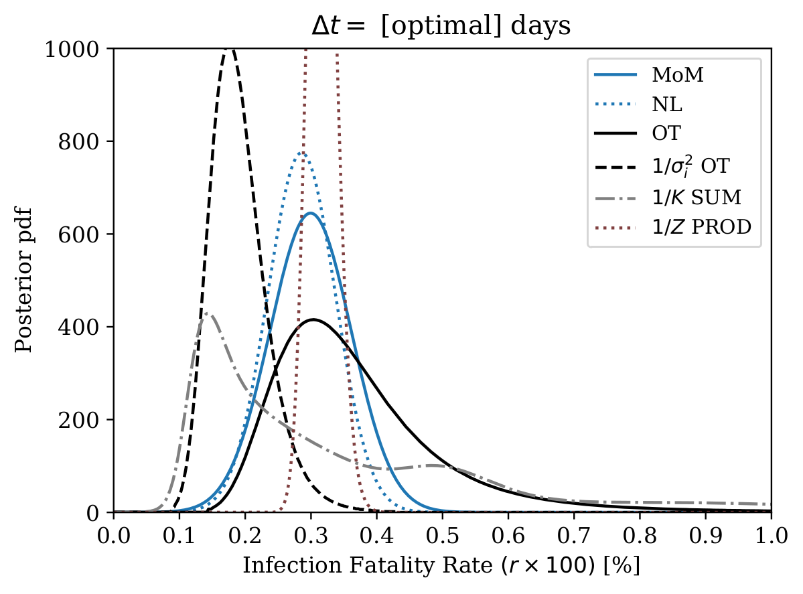
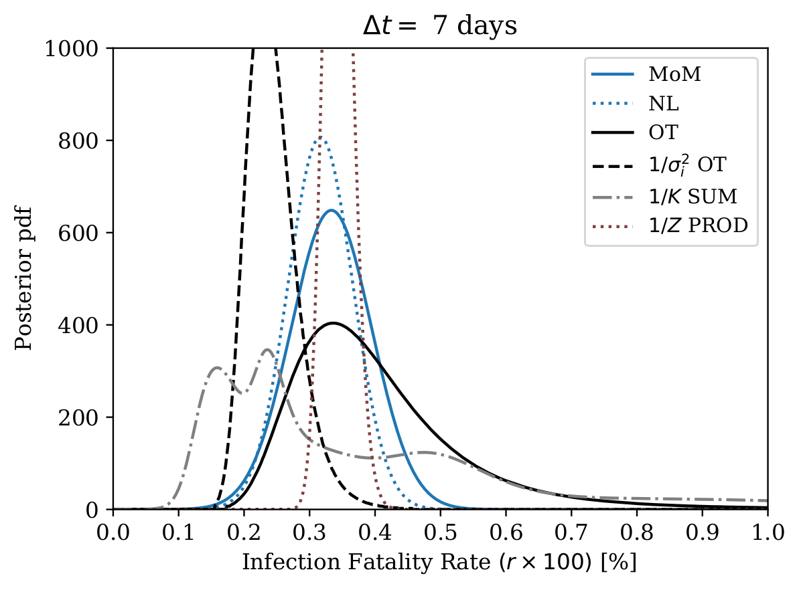
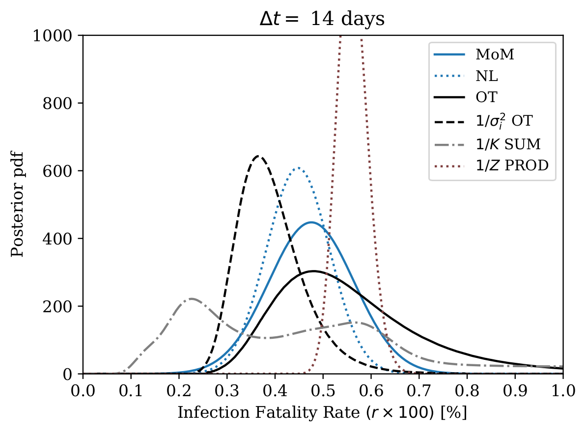

# covidgen

*"Statistical techniques to estimate the SARS-CoV-2 infection fatality rate"*

https://www.medrxiv.org/content/10.1101/2020.11.19.20235036v1

[](https://opensource.org/licenses/MIT)



## Dependencies

Python 3.8+ and pip packages under 'requirements.txt' are needed:

```
pip install -r requirements.txt
```

## Folder structure
```
- analysis   : analysis steering and dataset scripts
- covidgen   : library (module) functions
- data       : input time-series files (csv)
- dataconfig : dataset analysis configurations
- figs       : output figures (pdfs)
- output     : output files (pickle)
- tests      : test and aux scripts
- tex        : output latex (tables)
```

## IFR estimates and Combination Analysis

Infection fatality rate (IFR) computations based on individual datasets are done first. Then these results are combined. Execute:

```
python ./analysis/run_compute_IFR.py
python ./analysis/run_analyze_IFR.py
```

The full computation may take 10 minutes per individual dataset, which takes into account the statistical and systematic uncertainties and involves also deconvolution inversion. The combination analysis is based on classic and modern methods: such as random effects meta-analysis, together with algebraic and optimal transport combinations of posterior PDFs. Different underlying risk functions can be associated with each method.


## 3D-Bernoulli MC

Try first with 10000 Monte Carlo generator samples:
```
python ./covidgen/sim.py --R 10000
python ./analysis/analyze_sim.py
```

Get instructions:
```
python ./covidgen/sim.py --help
```

## Mathematical methods


See the headers of each file under 'analysis' for descriptions. Execute with 'python ./analysis/run_x.py'


### Deconvolution and time-delays

Analyzing the infection fatality rate is affected by causal time-delays. This is treated as a deconvolution inverse problem.

```
run_generate_kernels.py
run_visualize_kernels.py
run_visualize_deconvolution.py
```

### Confidence and credible intervals

Different methods for computing statistical confidence intervals can be evaluated with the following functions.

```
run_bayesian_2D.py
run_bayesian_ratio.py
run_bootstrap_comp.py
run_coverage_sim.py
run_mc_confidence.py
run_neyman_belt.py
run_profile_likelihood.py
run_running_counts.py
```


## Visualize OWID time-series data

Raw time-series data can be visualized with:
```
python ./tests/visualize_OWID.py
```


m.mieskolainen@imperial.ac.uk, 2020
